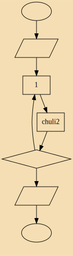

# 高性能语言学习实践
> 实践与提升(Practice and improve)  

### 内容介绍:

-  其他语言	: 
	-  go语言等其他内容
- Julia：Julia语言的相关内容
	- 性能与抽象兼具的程序设计语言
- Rust ： rust语言相关内容
	- 进行安全优化后的编译型语言
- C++  :  C/C++和汇编相关
	- 自由的程序设计语言 
- LICENSE ：本项目证书文件

### 问题&&解决方法:
-  QT无法输入中文?  
解决方法:<https://www.cnblogs.com/xia-weiwen/p/6857237.html>
- 如何画流程图？
	- dot画流程图，模板如下：
	- 代码：
```c
digraph 流程图 {
	label="流程图名称"
	bgcolor=wheat
	//rankdir=LR   //从左到右的流程图，默认是从上到下 
	
	node [shape=ellipse] 开始 结束; 
	node [shape=parallelogram] 输入 输出;  //平行四边形
	node [shape=diamond] 条件判断; //菱形判断框
	node [shape=box]  //默认节点为长方形
	
	
	开始->输入->处理1->chuli2->条件判断->输出->结束
	条件判断->处理1
}


// 命令
//dot -Tsvg 流程图模板 -O
```




### 其他

- 开源字体:
	- firacode:最佳编程字体
	- inconsolata:漂亮的等宽字体
	- dejavu:覆盖了unicode 的绝大不部分
- 对一些语言的评论
	- 小型和灵活性上, **python** 比java 更胜一筹
	- windows会继续支持**C#**
	- 苹果偏爱 **swift**
	- android 推出 **kotlin**
	- google用 **go**
	- **java** 会稳定在对跨平台有严格要求的大型非时时应用上
	- 
- 编程语言的开始学习时间


时间|语言|备注
:-|:-:|:-
2014|C|基本语法+过程式编程
2015|C++|面向对象+stl
2016|Java，C#|Android基础+C#界面
2017|Bash|命令+常见应用+（KDE5，Gnome，xfce4）+Cpp2
2018|Python3|python标准库+读文档
2019|Julia|2D数据可视化+Cpp3
2020|

- 