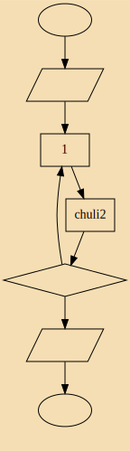

# 高性能语言学习实践
> 实践与提升(Practice and improve)  

## 内容介绍:
- project: 已完成项目归档
-  Golang 	: go语言的基本语法
- Julia：Julia语言的相关内容
- Rust ： rust语言相关内容
- C++  :  C/C++和汇编相关
- LICENSE ：证书文件

## 问题&&解决方法:
-  QT无法输入中文?  
解决方法:<https://www.cnblogs.com/xia-weiwen/p/6857237.html>
- 如何画流程图？
	- dot画流程图，模板如下：
	- 代码：
```
digraph 流程图 {
	label="流程图名称"
	bgcolor=wheat
	//rankdir=LR   //从左到右的流程图，默认是从上到下 
	
	node [shape=ellipse] 开始 结束; 
	node [shape=parallelogram] 输入 输出;  //平行四边形
	node [shape=diamond] 条件判断; //菱形判断框
	node [shape=box]  //默认节点为长方形
	
	
	开始->输入->处理1->chuli2->条件判断->输出->结束
	条件判断->处理1
}


// 命令
//dot -Tsvg 流程图模板 -O
```



- 
## 其他
- 开源字体:
	- firacode:最佳编程字体
	- inconsolata:漂亮的等宽字体
	- dejavu:覆盖了unicode 的绝大不部分
- 