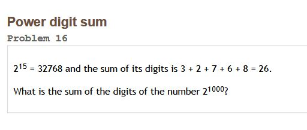
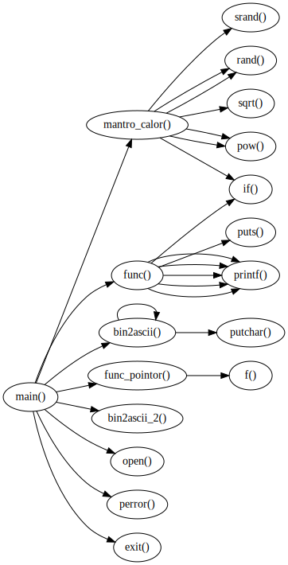

# julia 代码备份


```julia

# 10年翻了60倍,每年翻多少?
# n年翻了y倍,每年翻多少(x)?

function 年均增速计算(年数,倍数)
	base,start=0.0,10.0
	#@info base,start
	#二分查找
	function 比较(x) return (x^年数<倍数 ? true : false) end
	function 平均(a,b) return (a+b)/2 end
	while 比较(start) 
		start*=2
	end
	for i=1:20  #精度控制在小数点后四位
		tmp=平均(base,start)
		if 比较(tmp)
			base=tmp
		else
			start=tmp
		end
		#@info "执行次数$i;取值区间$base ~ $start"
	end
	return 平均(base,start)
end
@time @info 年均增速计算(10,60)
@time @info 年均增速计算(3.5,60000)
@time @info 年均增速计算(20,0.2)

```


## 计算2^1000的按位 加和

```julia
function 指数(num::Int,init::Int=2)  #计算指数
	tmp::BigInt=init
    return tmp^num
end
function sum_bigInt()  #计算2^1000的位值加和
	function char2num(item::Char)
		table=Dict(['0'=>0,'1'=>1,'2'=>2,'3'=>3,'4'=>4,'5'=>5,
			'6'=>6,'7'=>7,'8'=>8,'9'=>9])
		if item in keys(table)
			return table[item]
		end
	end
	num::Int=0
	tmp_str=repr(指数(1000))
	for char in tmp_str
		num+=char2num(char)
	end
	@info "位数为:$(length(tmp_str))"
	@info "2^1000:加和的结果为 $num ."
	@info "每一位上的平均值为:$(num/length(tmp_str))"
	@show tmp_str
end
sum_bigInt()  #结果是1366
```
## 有序数据->无序数据

```julia
#
#	排序的逆向操作
#		有序数据->无序数据
#
function 交换(arr::Array,p1::Int,p2::Int)
	tmp::Int=arr[p1]
	arr[p1]=arr[p2]
	arr[p2]=tmp
end
function 打散数据!(arr::Array) #使用随机数 进行交换
	size=length(arr)
	系数=1
	#0.3  0.5	0.6		0.7   0.8  0.9  1  1.2  2
	#50  37		31		27	  21	15	10	10	3
	for i=1:Int(round(size*系数))
		交换(arr,rand(1:size),rand(1:size))
	end
	
end
function 打散数据2!(arr::Array)
	size=length(arr)
	系数=0.8
	for i=1:Int(round(size*系数))
		交换(arr,rand(1:size),rand(1:size))
	end
	
	tmp=arr[1]
	for i=1:(size-1)
		arr[i]=arr[i+1]
	end
	arr[size]=tmp
end
function 相似度检验(arr1::Array,arr2::Array)
	size1=length(arr1)
	size2=length(arr2)
	@assert size1==size2 "两个集合的项数不等."
	
	count::Int=0
	for i=1:size1
		if arr1[i]==arr2[i] count+=1 end
	end
	return round((count/size1),digits=4)
end
function test()
	arr::Array=[]
	arr_tmp::Array=[]
	
	for i=1:100000 push!(arr,i);push!(arr_tmp,i) end
	#@info arr[40:50]
	#打散数据!(arr)
	打散数据2!(arr)
	#@info arr[40:50]
	
	result=相似度检验(arr_tmp,arr)
	@info "两个数组的相似度为:$(result*100)%"
	
end
test()

```
## 寻找勾股数
```julia
"""
	寻找勾股数(整数): 3,4,5 .......
		a,b,c
		(1) a不变,b(区间遍历)  寻找c 
				限制:c^2<a^2+b^2
		(2) a+=1,重复(1)
		
"""


function 寻找勾股数(end_val::BigInt )   #无限大版本
	 a::BigInt=3;
	 b::BigInt=3;
	 c::BigInt=3;
	区间=100
	@info "计算勾股整数对 开始......"

	while a < end_val
		while b<(a+区间)
			while c< Int(  round(sqrt(a^2+b^2)+1)  )
				if c^2 ==(a^2+b^2) 
				#@info "$a 的平方$(a^2) +  $b  平方$(b^2)==$c 的平方$(c^2)"
					write(io,"$a,$b,$c \n ")
				end
				c+=1
			end
			b+=1
			c=b
		end
		a+=1
		b=a
		flush(io)
	end
	@info "计算结束!"
end
function 寻找勾股数(end_val::Int)
	 a=3;
	 b=3;
	 c=3;
	区间=100
	@info "计算勾股整数对 开始......"

	while a < end_val
		while b<(a+区间)
			while c< Int(  round(sqrt(a^2+b^2)+1)  )
				if c^2 ==(a^2+b^2) 
					write(io,"$a,$b,$c \n ")
				end
				c+=1
			end
			b+=1
			c=b
		end
		a+=1
		b=a
		rand(1:10)==7 ? flush(io) : continue ;#避免每次都flush,注意?:前后的空格
	end
	@info "计算结束!"

end

function 计算大指数(底数::Int,指数::Int) a::BigInt=底数;return a^指数 end

function test()
	
	num::BigInt=2^30 #计算大指数(2,100) ;
	#寻找勾股数(num)
	寻找勾股数(100_0000)
end

io=open("tmp1.txt","w+")  #io定义必须放在全局
@time test()
close(io)
```
##函数调用结构图

```julia
"""
				建立函数调用结构图
				
	功能:
		1 获取本目录里的所有文件
		2 逐个文件进行函数调用关系提取
		3 将提取出的关系进行dot化
	缘起:
		dot的应用方式,
		手写的话并不比图形化的软件方便
		
"""

function build_function_struct_graph()

	function get_path(c::Channel)
		#默认为本目录
		for (root,dirs,files) in walkdir(".")  # 1 
		       for file in files
		           path=(root*"/"*file)
		           put!(c ,path)
		       end
		end
	end
	
	function 函数内容提取(file_str)  #2.1
	# 提取出完整的函数内容 如: asd(){   ...   }
		rx=r"\w+?\(.*?\)\s*?\{(.|\n)*?\}"   
		#单词边界,word{  ... }  不能有空格
		#写正则表达式的费力之处:你要覆盖所有的情况
		#不能多也不能少
		m=eachmatch(rx,file_str)
		return collect(m)
	end
	function 函数识别(item)  
		#2.2
		#识别str中的函数,并返回 函数名列表
		#形式: a->{b,v,c,,d,s;b->{}}
	
		rx=r"\w+?\("
		m=eachmatch(rx,item)
		vec= collect(m)
		repr="\""*(popfirst!(vec).match)*")\"->"
		for item in vec
			repr=repr*"\""*(item.match)*")\","
		end
		return repr
	end
	
	function get_func_relation(file_path)  #  2
		relation= ""
		@info file_path
		file_str=""
		for line in eachline(file_path,keep=true)
			#keep=true :保持换行符号
			file_str=file_str*line
		end
		for item in 函数内容提取(file_str)
			str_exp=函数识别(item.match)  
			#item 是Regexmatch类型,item.match存储匹配的字串
			str_exp=chop(str_exp)   #chop : 去掉末尾的逗号||->
			relation=relation*(endswith(str_exp,"-") ? chop(str_exp) : str_exp)*";"
			#chop后有两种情况:->变为-,去掉,号
		end
		return relation  #形式: a->b,v,c,,d,s;b->,; a->b,v,c,,d,s;b->{}
	end
	
	function 文件类型确认(file_name)
		if  !isfile(file_name) return false; end
		if endswith(file_name,".c") 
			return true 
		else 
			return false
		end
	end
	
	
	str_repr=""
	for path_file in Channel(get_path)
		if  !文件类型确认(path_file) #去掉配置文件等无关项
			continue
		end
		tmp=get_func_relation(path_file)
		str_repr=str_repr*"\n"*tmp
		#break #只执行一个C文件
	end
	str_repr="digraph function { \n "*str_repr*"\n }"
	#@show str_repr
	
	#写入文件
	write("tmp.gv",str_repr)
	@info "文件写入完成"
end
build_function_struct_graph()

#ERROR: LoadError: PCRE.exec error: JIT stack limit reached
#目录下的文件太多导致

#图像生成命令
# dot -Tsvg tmp.gv -O

#如何去掉语句
# if(){} switch(){} ...

```
### 三个示例:
- 前三张图片为systemd/src的三个子目录
- 文件横向太大可能显示异常,可到pict/下的查看src-*.svg
- 图片本地图片查看器显示异常,可用firefox打开.
- 第四张图片为纵向简单示例




