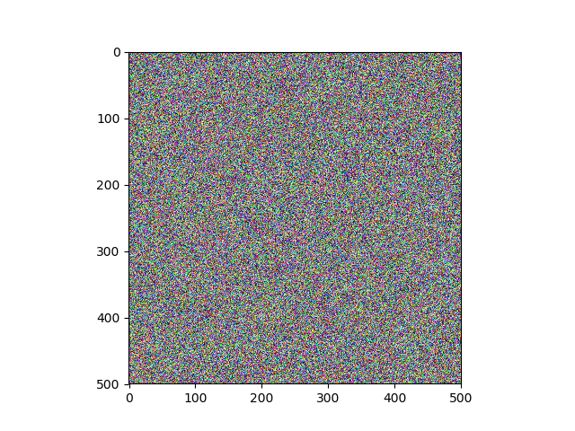
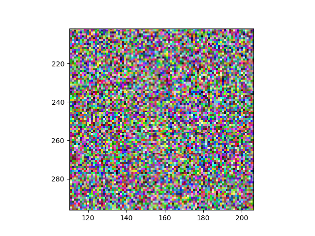
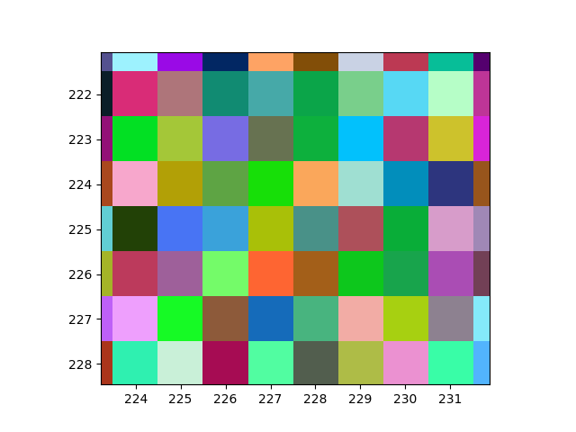
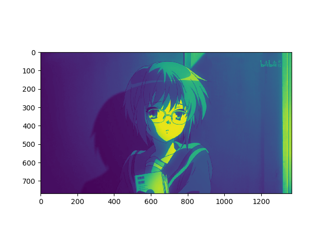
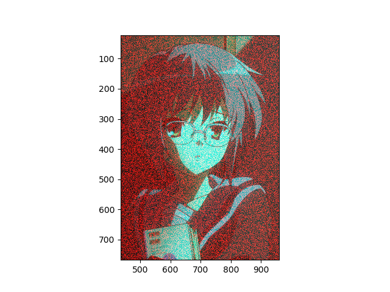
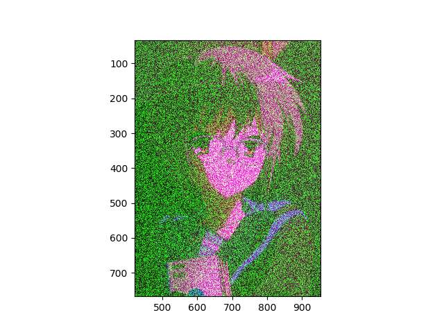
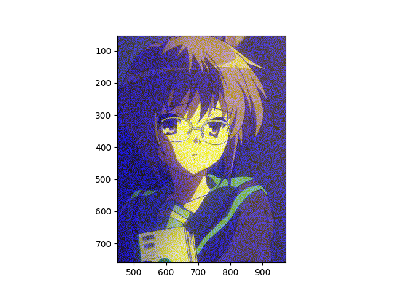
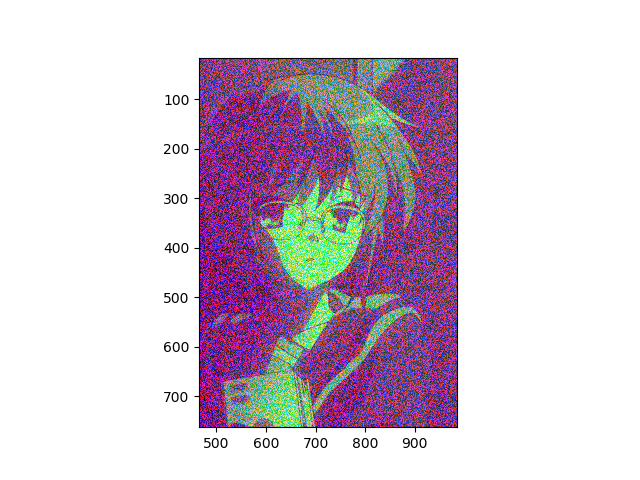

<link type="text/css" rel="stylesheet" href="/css/style.css">


# 临时内容记录
##图像&&像素
#####array{rand(Float32,(500,500,3))}

#####放大图

#####再放大图:每个方块即为显示器三原色(红,绿,蓝)组成的像素点


---
### 单层显示

### 第1层加噪声

###第2层加噪声

###第3层加噪声

### 1,3两层加噪声


---
##平均池化
平均池化")
平均池化")
平均池化")

```julia
function 最小!(A,B,edge,lay::Int) 
#edge : 四个数的块:2,九个数的块:3
	x,y=size(A)
	function 圈值(A,row,col)
		val=1000000.0
		for i=0:(edge-1)
			for j=0:(edge-1)
				if (row+i)>x || (col+j)>y
					continue
				else
					if val> A[row+i,col+j]  
						 val=A[row+i,col+j] 
					end
				end
			end
		end
		return val/(edge^2)
	end
	for i=1:x
		for j=1:y
			B[i,j,lay]=圈值(A,i,j)
		end
	end
end
function 最大!(A,B,edge,lay::Int) 
#edge : 四个数的块:2,九个数的块:3
	x,y=size(A)
	function 圈值(A,row,col)
		val=0.0
		for i=0:(edge-1)
			for j=0:(edge-1)
				if (row+i)>x || (col+j)>y
					continue
				else
					if val< A[row+i,col+j]   val=A[row+i,col+j] end
				end
			end
		end
		return val/(edge^2)
	end
	for i=1:x
		for j=1:y
			B[i,j,lay]=圈值(A,i,j)
		end
	end
end
function 平均!(A,B,edge,lay::Int) 
#edge : 四个数的块:2,九个数的块:3
	x,y=size(A)
	function 圈均值(A,row,col)
		val=0.0
		for i=0:(edge-1)
			for j=0:(edge-1)
				if (row+i)>x || (col+j)>y
					val+=0
				else
					val+=A[row+i,col+j]
				end
			end
		end
		return val/(edge^2)
	end
	for i=1:x
		for j=1:y
			B[i,j,lay]=圈均值(A,i,j)
		end
	end
end
function rgb2single!(A,B) #不同于jpg 转不成gray
	#0.29900 * R + 0.58700 * G + 0.11400 * B=gray
	x,y=size(B)
	for i=1:x
		for j=1:y
			#B[i,j]=(A[i,j,1]*0.29900)+(A[i,j,2]*0.58700)+(A[i,j,3]*0.11400)
			B[i,j]=A[i,j,3]
		end
	end
end
function single!(A,lay)
	x,y=size(A)
	for i=1:x
		for j=1:y
			# A[i,j,lay] = rand(Float32) #第lay层添加噪声 
			A[i,j,lay]=0.1
		end
	end
end
using PyPlot

function test()
	asd = imread("cmyx.png")
	@show size(asd) typeof(asd)
	A=asd
	@show size(A) typeof(A)
#======================================
	 
	single!(A)
	imshow(A)
	show()

return
===================================#
	B=similar(A)
	for  lay in [1,2,3]
		for i in [3,5,8]
			#平均!(A[:,:,lay],B,i,lay)
			#最大!(A[:,:,lay],B,i,lay)
			最小!(A[:,:,lay],B,i,lay)
			imshow(B)
			show()
		end
	end
	@info "执行结束"
return

	A=[1 2 3;
		4 5 6;
		7 8 9]
	B=similar(A)
	mohu!(A,B)
	@show B,A
	
end
test()
```